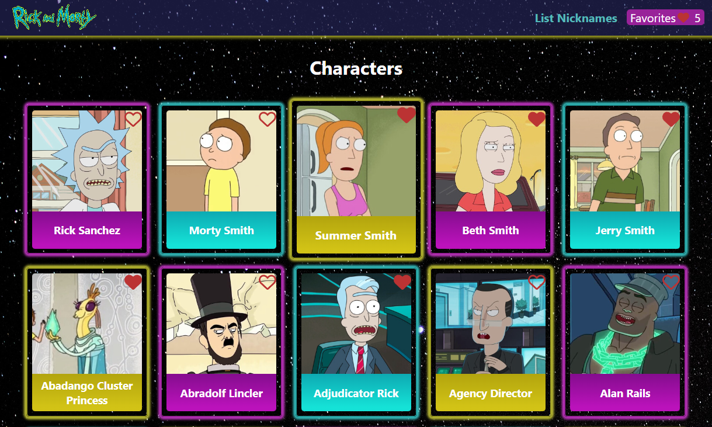
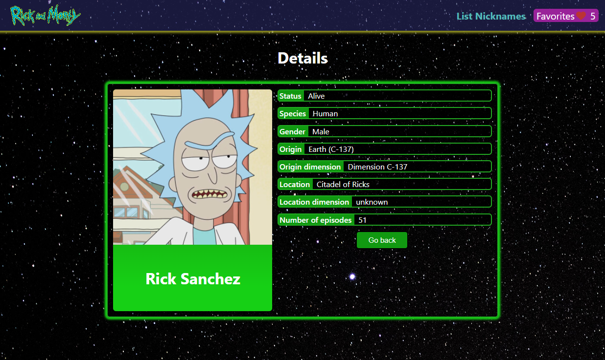
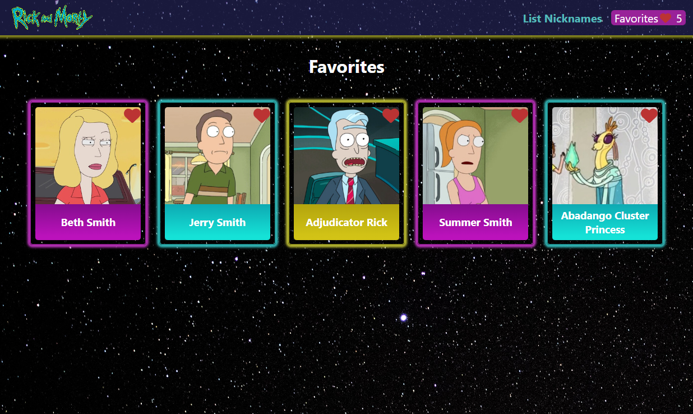
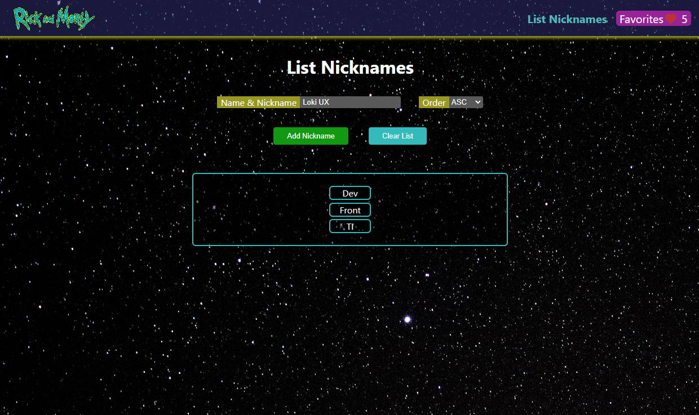
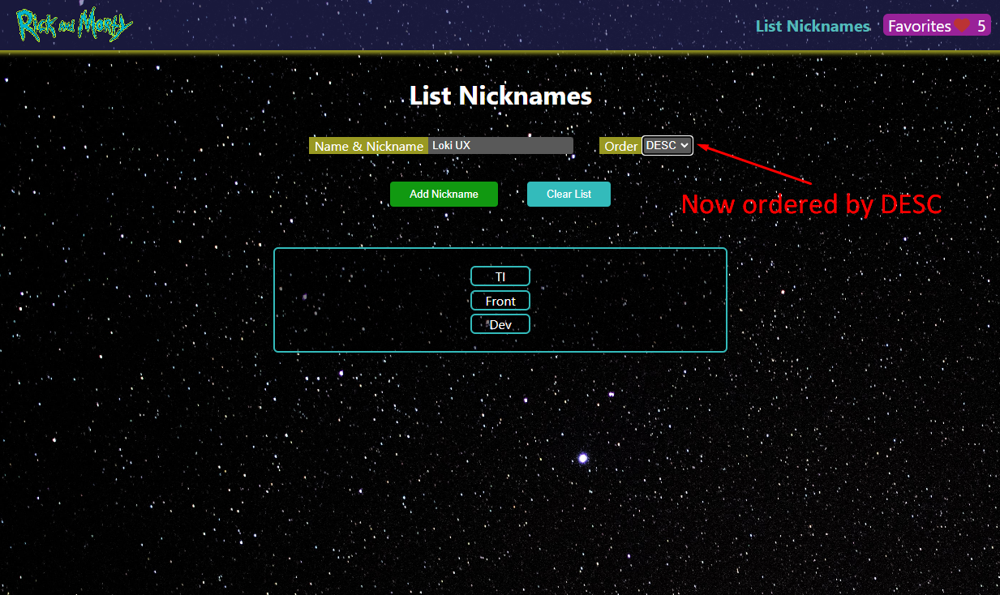
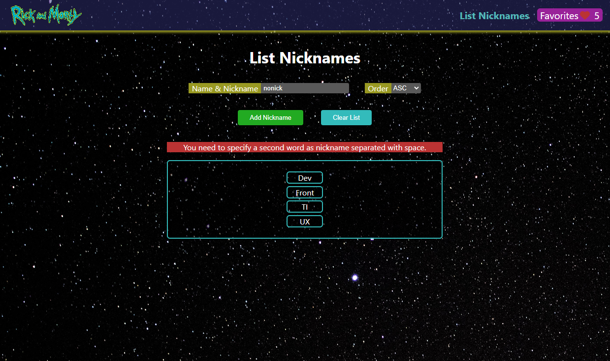

# Rick and Morty - React


This is a website that use a GraphQL API to retrieve information about characters from cartoon TV show named Rick and Morty.

## Available Scripts

In the project directory, you can run:

### `npm start`

Runs the app in the development mode.\
Open [http://localhost:3000](http://localhost:3000) to view it in your browser.

The page will reload when you make changes.\
You may also see any lint errors in the console.


## Features
- It shows basic information about characters in different card each one, you can click on to show detailed information.
- You can select each character as Favorite clicking on the heart icon at the right-top corner of the card.
- The same way you can unselect clicking on the Heart. The count of favorites is in the header with their button.
- Clicking on the Favorite's button you can access to selected characters as favorites.
- You can return directly to home clicking on the **Rick and Morty logo** on the header.
- The Exercise 1 is explained in this README more below.
- The Exercise 2 is explained in this README too, but implemented in **List Nicknames** navbar option.


## Characters
This is the homepage, it shows all the characters with their name in colored cards, you can select as Favorite clicking on the outlined heart that becomes to solid heart.
Also, if you click on the card directly, you navigate to other page with detailed information about selected character.

\
## Detailed
This page has specific information about character previously selected. You can return to characters or favorites list clicking on the **Go back** button.

\
## Favorites
Here shows all selected characters as favorites, you can unselect clicking on the red heart and this card will be disappeared.

\

## Exercise 1 - Numeric array function

### Solution
```javascript
function sum(array2d) {
    const result = array2d.flat().reduce((total, current) => total + current, 0)
    return (doSomethingWithResult) => doSomethingWithResult(result);
}
```

### Examples
```javascript
sum([1,3,4])(console.log); // Output: 8
sum([[1],[3],[4]])(console.log); // Output: 8
sum([[1,1,1],[2,2,2],[3,3,3]])(console.log); // Output: 18
sum([[1,1,1,1,1],[2,2,1],[3,2],5])(console.log); // Output: 20
```

## Exercise 2 - Nicknames List component

### Component fields
This page has a text field where you need to type a name with the nickname separated by a space, a select field that you can choose the order
of a nick list is ASC or DESC. The button to add nickname and clear the list.

\

### Change order
If you select ASC, the nicknames list will be ordered A-Z-a-z, take note that uppercase letters is first than lowercase letters. Otherwise, when you select DESC the order is inverted.

\

### Validations
If you type incorrect values in the text field, when you click on **Add Nickname** button an error message will be displayed, the following messages are:
- Name & Nickname can't be empty.
- You need to specify a second word as nickname separated with space.
- The nickname already exists in the list. Try another.

\

## Authors
- Cristian Pinzón: [LinkedIn](https://www.linkedin.com/in/cristian-pinzon28/)